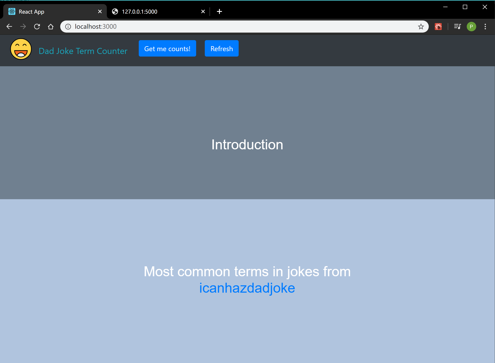
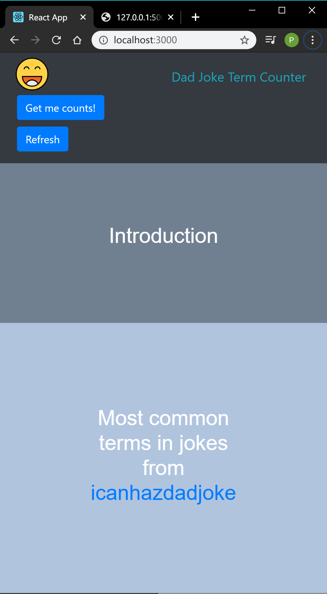
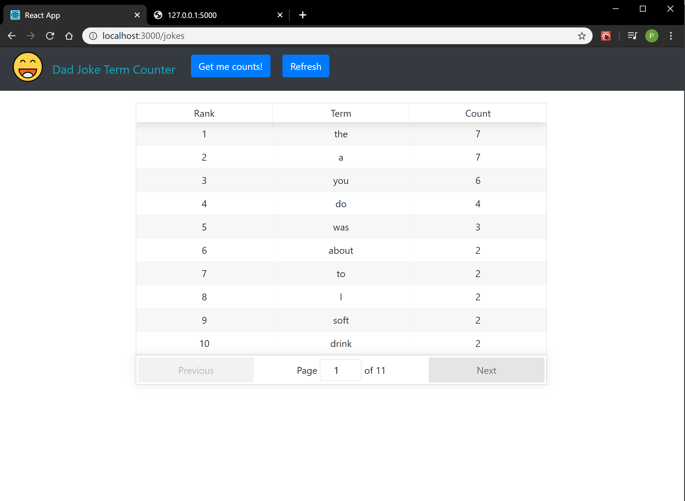
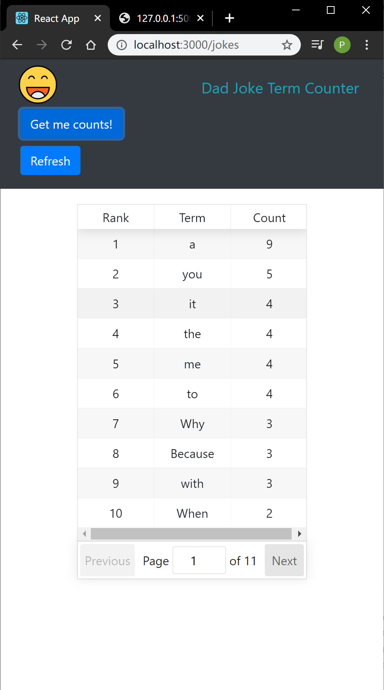
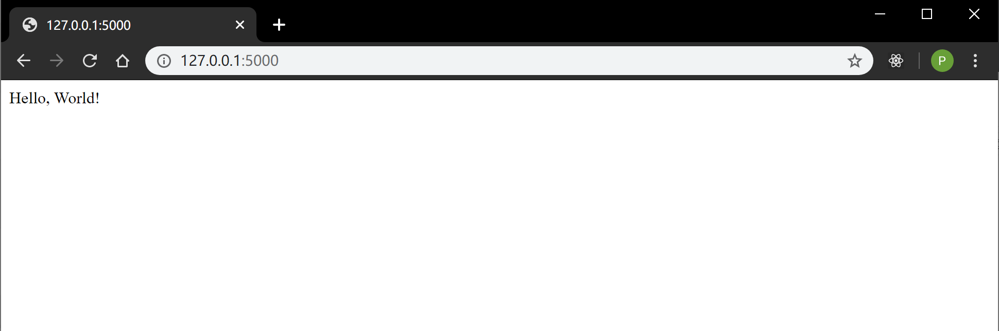

## Simple Full-Stack Project 
- Frontend: React
    - axios, bootstrap, styled-components, react-table, react-router-dom
    
- Backend: Python Flask

- Install and Run (Windows)
    - Run server at http://127.0.0.1:5000
        - open a terminal, in \server directory
        - `flask\Scripts\activate`
        - `app.py` 
    - Run client at http://localhost:3000 
        - open another terminal, in \client directory
        - `yarn install`
        - `yarn start`

- Preview    
    - Main page:
    
    
    
    - Joke term count page:
    
    
    
    - Backend running
    
    
      

